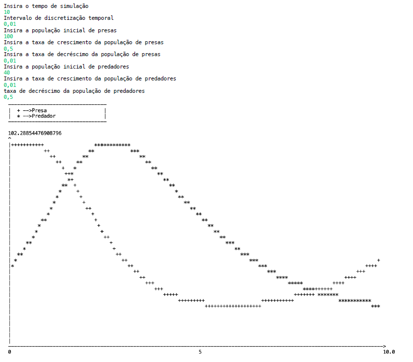

# Lokta-Volterra Model

A simple Java program that implements the Lotka-Volterra predator-prey model using Object-Oriented Programming (OOP) concepts. This project was developed for an Informatics Systems class.

The program simulates population dynamics between predators and prey based on the Lotka-Volterra equations. The user inputs parameters such as simulation time, initial populations, and model variables, with all inputs validated for type and range before running the simulation.

**Output Example:**

